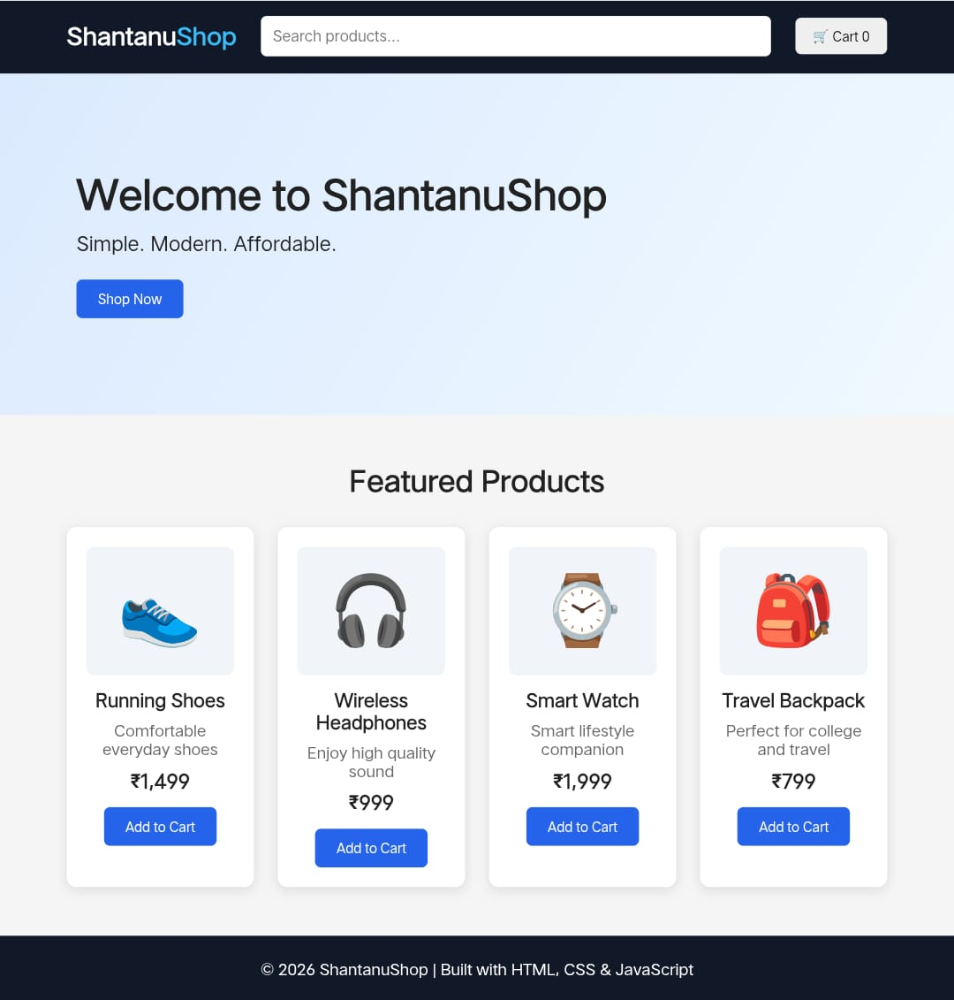

🛍️ ShantanuShop

A simple and modern frontend shopping website built using HTML, CSS, and JavaScript.

ShantanuShop is a beginner-friendly e-commerce UI project designed to practice frontend web development, responsive layouts, product cards, search functionality, and cart interactions.

## 📸 Website Preview

🌐 **[Live Demo](https://shantanudas20000-ship-it.github.io/Shopping-website/)**

---

✨ Features

- 🔍 Product search
- 🛒 Shopping cart
- 🏠 Modern hero section
- ⭐ Featured products
- 🛍️ Add to Cart functionality
- 💰 Product pricing
- 📱 Responsive frontend design
- ⚡ Interactive JavaScript functionality
- 🎨 Clean and simple user interface

---

🛍️ Featured Products

Product| Price
👟 Running Shoes| ₹1,499
🎧 Wireless Headphones| ₹999
⌚ Smart Watch| ₹1,999
🎒 Travel Backpack| ₹799

---

📂 Project Structure

Shopping-website/
│
├── index.html
├── style.css
├── script.js
└── README.md

"index.html"

Contains the main structure and content of the shopping website.

"style.css"

Contains the website styling, layout, colors, spacing, and responsive design.

"script.js"

Handles interactive features such as product search and shopping cart functionality.

---

### 💻 Tech Stack

- **HTML5** — Website structure
- **CSS3** — Styling and responsive layout
- **JavaScript** — Interactivity and functionality
- **GitHub Pages** — Website deployment

---

🚀 Getting Started

Clone the repository

git clone https://github.com/shantanudas20000-ship-it/Shopping-website.git

Open the project

Open the project folder in Visual Studio Code.

You can then open "index.html" in your browser or use the Live Server extension in VS Code.

---

🎯 Project Goals

This project was created to practice:

- HTML page structure
- CSS styling and layouts
- JavaScript DOM manipulation
- Search functionality
- Shopping cart logic
- Frontend project organization
- Git and GitHub
- GitHub Pages deployment

---

🔮 Future Improvements

Planned improvements for future versions:

- 🔐 Login and registration UI
- 🛒 Improved cart page
- 💳 Checkout page UI
- ❤️ Wishlist functionality
- 🏷️ Product categories
- 📦 Product details page
- 📱 Improved mobile experience
- 🌙 Dark mode
- 🔎 Advanced product filtering

---

👨‍💻 Author

Shantanu Das

B.Tech CSE Student

Interested in Web Development, Programming, and Data Structures & Algorithms.

---

⭐ Support

If you like this project, consider giving the repository a ⭐ on GitHub.

---

📌 Disclaimer

This is a frontend learning project created for educational and practice purposes. It does not process real payments or orders.
